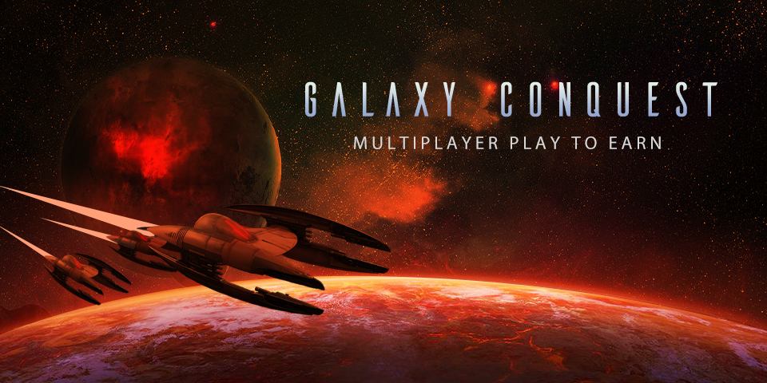

# Realtime multiplayer play to earn blockchain game

This project is part of the Moralis/Cronos hackathon submission.

## Services/ libraries used in the game

- [Phaser 3](https://phaser.io)
- [p2 NPM library](https://www.npmjs.com/package/p2)
- [Ably Realtime](https://www.ably.com) 

You will require an Ably API Key, to run this demo, [sign-up for FREE account](https://ably.com/sign-up)

# How to run this game

1. Create a free account with [Ably Realtime](https://www.ably.com) and obtain an API Key
1. Clone this repo locally
1. Navigate to the project folder and run `npm install` to install the dependencies
1. Rename `.env-sample` to `.env`, then edit the file and add your Ably API key and prefered PORT (default 8080).
1. (Optional) You can update the `MIN_PLAYERS_TO_START_GAME` to enforce a minimum number of players. (see `server-worker.js`)
1. Run the server with `node server.js` and then open a brower to [localhost:3000](http://localhost:3000)

# Credits
The game is based on a blog post tutorial made for Ably [dev.to](https://dev.to/ably/building-a-realtime-multiplayer-browser-game-in-less-than-a-day-part-1-4-14pm).

Please [reach out to me on Twitter](https://www.twitter.com/voicetechguy1) for any questions
